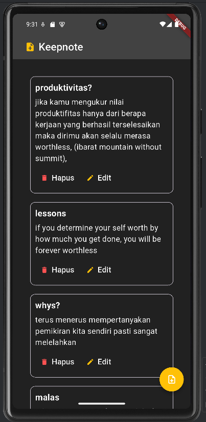

# mobile-programming-tugas-1

*Duevano Fairuz Pandya - 5025211052*
demo emulator : [video](https://drive.google.com/file/d/13qUbmV_Sro7hSjQenimiMV8a35d91YWo/view?usp=sharing)

Keepnote 
a simple note application which able to do create, read, update, and delete, 
all of the note data was store locally without using any db yet,

